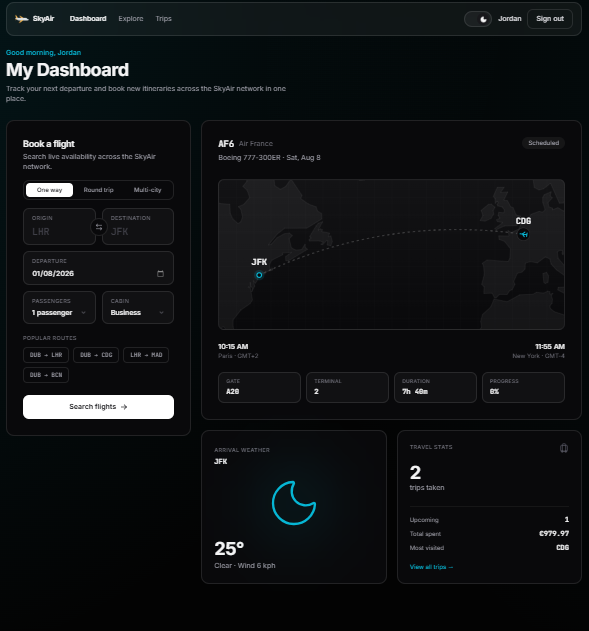
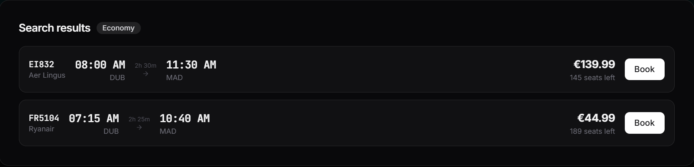
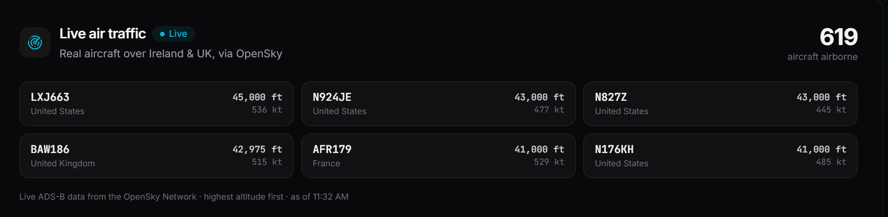

# SkyAir

A full-stack airline booking platform - flight search, per-cabin seat inventory, payments, and live aircraft tracking - built with Spring Boot and React.

> **SkyAir is a fictional airline.** This is a portfolio project: no bookings are real, no payments are processed, and it is not affiliated with any company using a similar name.

<p>
  
  
  
  
  
  
  <a href="https://github.com/Jordan-S1/airline-booking-app/actions/workflows/ci.yml"></a>
</p>



---

## What it does

- **Search and book** one-way, round-trip and multi-city itineraries across a 25-airline, 43-airport network
- **Per-cabin seat inventory** - economy, business and first are tracked separately, and a booking cannot oversell a cabin
- **Payments** through a simulated gateway, with refunds issued _before_ a cancellation releases the seat
- **Live air traffic** from the OpenSky Network's ADS-B feed, proxied server-side to stay within the anonymous rate tier
- **Multi-currency display** - prices are stored in EUR and converted only for display
- **Admin console** - full CRUD over flights, airlines and airports, plus a network-wide booking view
- **Rolling timetable** - flight numbers are treated as daily services and materialised across a moving horizon, so there is always bookable inventory
- **Password reset** by single-use, expiring token - see the note below on why no email is sent
- **AI travel assistant** - ask for flights in plain English and get real rows back, never invented ones



---

## Architecture

```
┌──────────────────────────┐        ┌──────────────────────────┐
│  React 19 + TypeScript   │  JWT   │   Spring Boot 3.5 API    │
│  Vite · Tailwind 4       │ ─────► │   Spring Security        │
│  framer-motion · axios   │        │   JPA · Flyway           │
└──────────────────────────┘        └───────────┬──────────────┘
                                                │
                        ┌───────────────────────┼───────────────────────┐
                        │                       │                       │
            ┌───────────▼──────────┐ ┌──────────▼─────────┐ ┌───────────▼──────────┐
            │    PostgreSQL 18     │ │  OpenSky (ADS-B)   │ │   Anthropic API      │
            │ 14 Flyway migrations │ │   live traffic     │ │  travel assistant    │
            └──────────────────────┘ └────────────────────┘ └──────────────────────┘
```

**Stateless JWT auth.** No server-side sessions. The token carries the user's role and id; `@PreAuthorize` on controller methods enforces access.

**UTC everywhere.** Departure and arrival times are stored as UTC instants. Each airport carries an IANA timezone and conversion happens only at the display layer, so a Dublin→Madrid flight shows correct local times at both ends without the stored data ever being ambiguous.

**Schema owned by migrations.** Hibernate runs with `ddl-auto=validate` and never alters the database. Flyway is the single source of truth, so a mismatch between an entity and a migration fails at startup instead of drifting silently.

---

## Quick start

**Prerequisites:** Docker · Java 21 · Node 20.19+ or 22.13+

```bash
git clone https://github.com/Jordan-S1/airline-booking-app.git
cd airline-booking-app
```

### 1. Configure the backend

```bash
cd backend
cp .env.example .env
```

Generate the JWT secret rather than inventing one - it must be Base64 decoding to at least 32 bytes, or the app refuses to start:

```bash
openssl rand -base64 32
```

| Variable                         | Required | Notes                                                                                  |
| -------------------------------- | :------: | -------------------------------------------------------------------------------------- |
| `DB_USERNAME` / `DB_PASSWORD`    |    ✅    | Also initialise the Postgres container                                                 |
| `JWT_SECRET`                     |    ✅    | Base64, ≥ 32 bytes decoded                                                             |
| `ADMIN_EMAIL` / `ADMIN_PASSWORD` |    ✅    | Seeds the first admin account on an empty database                                     |
| `DB_URL`                         |    -     | Only needed when running the API outside Docker; Compose points it at the `db` service |
| `SERVER_PORT`                    |    -     | Defaults to `8080`                                                                     |
| `ANTHROPIC_API_KEY`              |    -     | Enables the travel assistant. Blank disables it; everything else still runs            |
| `ANTHROPIC_MODEL`                |    -     | Defaults to `claude-opus-5`                                                            |
| `ANTHROPIC_MAX_TOKENS`           |    -     | Defaults to `8192`. Covers thinking as well as the reply                               |

### 2. Start the database and API

```bash
docker compose --profile app up -d
```

The `--profile app` matters - without it only Postgres starts, which is the mode to use if you would rather run the API from your IDE. The database is published on **5332** so it does not clash with a local Postgres on 5432.

Flyway applies all 14 migrations on first boot and seeds the network and timetable.

### 3. Start the frontend

```bash
cd ../frontend
cp .env.example .env
npm install
npm run dev
```

| Service    | URL                                   |
| ---------- | ------------------------------------- |
| App        | http://localhost:5173                 |
| API        | http://localhost:8080/api/v1          |
| Swagger UI | http://localhost:8080/swagger-ui.html |
| Health     | http://localhost:8080/actuator/health |

> CORS is restricted to `localhost:5173`. If Vite falls back to another port because 5173 is taken, either free it or add the new origin to `SecurityConfig`.

---

## Testing

```bash
cd backend  && ./mvnw test                    # 192 tests
cd frontend && npm run test && npm run lint && npm run build   # 57 tests
```

Most of the backend suite needs **no environment setup** - clone and run. 190 tests are unit and web-layer slices with mocked collaborators; two start a real PostgreSQL container and need a running Docker daemon.

| Suite                         | Tests | Covers                                                                                 |
| ----------------------------- | :---: | -------------------------------------------------------------------------------------- |
| `TravelAssistantServiceTest`  |  42   | Grounding, validation of every model-supplied field, degradation                       |
| `SeatClassUtilsTest`          |  33   | Cabin parsing, availability, price selection                                           |
| `BookingServiceTest`          |  28   | Seat inventory, ownership, status transitions, pricing, refund-before-release ordering |
| `PaymentServiceTest`          |  24   | Money handling, refunds, gateway failure paths                                         |
| `PasswordResetServiceTest`    |  15   | Token entropy, single use, expiry, user enumeration                                    |
| `AuthServiceTest`             |  11   | Password hashing, duplicate email, role assignment, credential failures                |
| `AuthControllerTest`          |   9   | HTTP contract and bean validation                                                      |
| `BookingControllerTest`       |   9   | Role-based access, checked from both an allowed and a forbidden role                   |
| `AssistantControllerTest`     |   6   | Both routes public, 503 rather than 500 when unconfigured                               |
| `UserServiceChangePasswordTest` | 7   | Current-password check, and why it answers 400 rather than 401                         |
| `AirportRepositoryTest`       |   7   | Search ranking, against a real Postgres                                                |
| `ApplicationTests`            |   1   | Context starts against a real Postgres                                                 |

Three design notes, because all three are easy to get wrong:

**The controller tests import the real `SecurityConfig`.** A `@WebMvcTest` slice does not load plain `@Configuration` classes, so `@EnableMethodSecurity` would be missing and `@PreAuthorize` would never run - every access-control test would pass while proving nothing.

**`ApplicationTests` uses Testcontainers, not H2.** Over half the migrations use Postgres-only syntax, so an in-memory database would mean disabling Flyway and generating the schema from the entities - precisely what `ddl-auto=validate` exists to catch. Against an empty container Flyway replays every migration and the entities are validated against the result. This test needs a running Docker daemon.

**`TravelAssistantServiceTest` mocks the model so it can lie.** The assistant's guarantee is that it holds _whatever the model says_, which is untestable against a real model - you cannot ask it to hallucinate on cue. With `ClaudeClient` mocked, the test scripts a summary naming a flight that does not exist and asserts the response still carries only the database row. Every mutation of the validation rules was checked to fail the test that claims to cover it; one test did not, and was rewritten.

---

## Continuous integration

[`.github/workflows/ci.yml`](.github/workflows/ci.yml) runs on every push and pull request against `main`.

| Job                                 | Does                                                     | Runs on                      |
| ----------------------------------- | -------------------------------------------------------- | ---------------------------- |
| **Backend tests**                   | `./mvnw test` - all 192                                  | every push and PR            |
| **Frontend tests, lint and build**  | `npm ci`, `npm run lint`, `npm test`, `npm run build`    | every push and PR            |
| **Publish image**                   | Builds the Dockerfile and pushes to GHCR                 | `main` only, after both pass |

No repository secrets are needed - publishing uses the built-in `GITHUB_TOKEN`.

Images are tagged `latest` and with the commit SHA, so a deployment can pin exactly what it runs rather than whatever `latest` happens to point at:

```bash
docker pull ghcr.io/jordan-s1/airline-booking-app:latest
```

Surefire XML is uploaded as an artifact on failure, which is the only way to see which case broke once the runner is gone.

---

## API

Full reference at `/swagger-ui.html`. Public routes need no token.

| Method  | Route                                                          | Access           |
| ------- | -------------------------------------------------------------- | ---------------- |
| `POST`  | `/auth/register`, `/auth/login`                                | Public           |
| `GET`   | `/flights`, `/flights/{id}`, `/flights/{id}/status`            | Public           |
| `POST`  | `/flights/search`, `/flights/search/multi-city`                | Public           |
| `GET`   | `/airports/**`, `/airlines/**`, `/currencies`, `/live-flights` | Public           |
| `POST`  | `/assistant`                                                   | Public           |
| `GET`   | `/assistant/status`                                            | Public           |
| `POST`  | `/bookings/user/{userId}`                                      | Customer · Admin |
| `PATCH` | `/bookings/{ref}/confirm`, `/bookings/{ref}/cancel`            | Customer · Admin |
| `GET`   | `/bookings/status/{status}`                                    | Admin            |
| `POST`  | `/flights`, `/airlines`, `/airports`                           | Admin            |
| `POST`  | `/payments`, `/payments/{txId}/refund`                         | Customer · Admin |

`GET /flights` is always paged (`?search=&page=&size=`, capped at 100). There is deliberately no unpaged variant - the timetable holds thousands of rows and grows with the rolling schedule.

**The two failure modes are distinguishable.** `401` means credentials are missing or no longer valid, and the client should send the user back to sign in. `403` means the caller is known but not permitted, and the session should be left alone. Conflating them signs people out for clicking a link meant for admins.

---

## Project layout

```
backend/
  src/main/java/com/airlinebookingsystem/
    config/       Security, CORS, data seeding
    controller/   REST endpoints
    service/      Business logic
    repository/   Spring Data JPA
    entity/       8 JPA entities
    dto/          Request and response records
    exception/    Domain exceptions + global handler
    security/     JWT filter, token service, auth entry point
  src/main/resources/db/migration/   14 Flyway migrations
  src/test/                          12 test classes

frontend/src/
  api/          Typed axios clients
  components/   Reusable UI, admin forms, widgets
  pages/        9 routed pages
  lib/          Auth, currency, theme, date helpers
  types/        Shared DTO types
```

---

## Implementation notes

**Compensating rollback for multi-leg bookings.** A round trip is two independent bookings with their own references, not a single PNR. If the second leg fails after the first is paid, the first is refunded and cancelled rather than left stranded.

**Refund before seat release.** Cancelling issues the refund first and releases the seat only if it succeeds. The reverse order can resell the seat while the customer is still out of pocket.

**Server-side OpenSky proxy.** The anonymous tier allows 400 credits a day and a bounding-box request costs 1–4. Calling it from the browser would spend that budget per visitor, so the backend fetches and caches it.



**Request-keyed loading state.** The frontend derives "loading" from whether the in-flight request still matches the current parameters, rather than assigning it inside an effect. This removes the stale-response race and satisfies the React Compiler's `set-state-in-effect` rule.

**Touch targets via `pointer-coarse`.** Interactive elements grow to 44 px on touch devices only, so the desktop layout keeps its intended density.

**Scroll reset on route change.** A client-side navigation swaps the component tree without touching scroll, so opening a destination from halfway down Explore landed halfway down the destination. `ScrollToTop` resets it - but only on a pushed navigation, and only when the pathname changes. Back and forward keep the position the reader chose, and a query-string change is a filter, not a new page. React Router's `<ScrollRestoration />` would do this, but only for data routers.

---

## AI travel assistant

Type "cheapest flight to Paris next Friday" and get real flights back. Set
`ANTHROPIC_API_KEY` to enable it; leave it blank and the app runs exactly as
before, with `GET /assistant/status` reporting `{"available": false}` so the
frontend hides the entry point rather than offering a feature that will fail.

**The model never invents a flight, because it is never asked for one.** It has
two jobs and the real search runs between them:

```
"cheapest flight to Paris next Friday"
        │
        ▼
   ① extract ──► {departureAirport: "DUB", arrivalAirport: "CDG", …}
        │
        ▼
   ✋ validate against the database ── fails ──► ask a question, search nothing
        │
        ▼
   ② FlightService.searchFlights()   ← unchanged, the same code the search page uses
        │
        ▼
   ③ summarise, given only those rows as facts
```

Step ① produces a claim, not a query. Every field is checked before it reaches
the search, and a field that fails is discarded rather than repaired:

| The model says                  | What happens                              |
| ------------------------------- | ----------------------------------------- |
| An airport not in the timetable | Discarded; asks where they mean. No search runs |
| A date in the past              | Refused; asks which date they meant        |
| A date past the rolling window  | Names the last date covered, rather than "no flights, try nearby" |
| Departure equal to arrival      | Asks where they are flying to              |
| A cabin that is not one of three| Falls back to `ECONOMY`                    |
| 47 passengers                   | Clamped to 9                               |
| A return date before departure  | Dropped silently; the one-way search stands |
| Something that is not JSON      | Asks them to rephrase - never a guessed search |

The first five stop the search, because filling them in would answer a question
nobody asked. The last three are corrected in place, because the intent is
unambiguous and a follow-up question would be noise.

The window's end is read from the timetable, not computed from
`flights.schedule.horizon-days`. The scheduler materialises dates in each
airport's own zone, so airports east of UTC push the last date a day past
`today + horizon` - copying that arithmetic here would mean copying the
correction too, and refusing a date that is genuinely bookable.

Step ③ produces prose, not data. The `flights` array is whatever the database
returned, so a summary that names a nonexistent airline makes the _wording_
wrong and nothing else - it cannot add a bookable flight or change a price.
Policing the wording as well would mean validating prose against the rows,
which is a separate piece of work and is not done here.

**Losing the prose does not lose the answer.** If summarisation fails after a
successful search, the flights are still returned with a plainly generated
sentence built from the same rows.

`ClaudeClient` is a thin `RestClient` wrapper over the Messages API that knows
nothing about flights - which is what makes the grounding testable, since the
mock can be told to say anything.

**On the dashboard**, `AssistantChat` renders the transcript, shows how each
sentence was read as a row of chips, and books through the same `BookingModal`
as the search panel - so the assistant is another way to drive the existing
flow rather than a second one beside it. It renders nothing at all unless
`/assistant/status` reports a key is configured.

---

## Password reset

There is no mail provider, so `POST /auth/forgot-password` writes the reset link
to the **server log** instead of sending it:

```
docker compose --profile app logs app | grep "Password reset link"
```

The link is deliberately not returned in the HTTP response. Doing that would
turn "forgot password" into account takeover for any address an attacker can
guess, which is a worse demo than one extra step. Everything else is the real
design:

- 256 bits from `SecureRandom`, not a UUID
- only the SHA-256 is stored, so the table is useless if it leaks
- single use, and expiring (`security.password-reset.ttl-minutes`, default 30)
- issuing a token retires the account's outstanding ones
- the request is answered identically whether or not the address is
  registered, so it cannot be used to discover who has an account
- unknown, expired and already-used tokens all give the same message

Adding email means changing where the link is delivered and nothing else.

---

## Credits

App icon: <a href="https://www.flaticon.com/free-icons/plane" title="plane icons">Plane icons created by Konkapp - Flaticon</a>

---

## Licence

Released under the [MIT License](LICENSE).

The MIT licence covers this project's own source. The app icon is third-party
and remains under Flaticon's free licence, which requires the attribution
above to be kept.

"SkyAir" is an invented name used to give the demo a subject. It is not a
trademark claim, and no affiliation with any real business using a similar
name is intended or implied.
